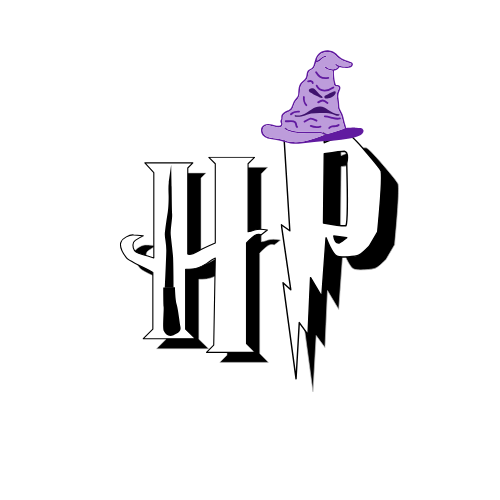

<div align="center">
  
</div>

# 🧙‍♂️ Harry Potter Characters App

Welcome to the **Harry Potter Characters App**, a Flutter-based application that retrieves and displays information about characters from the Harry Potter series. This app is built with Flutter, using Bloc Cubit for state management and integrating animations for a smooth user experience.

## ✨ Features

- **Fetch Character Data**: Retrieves real-time data about Harry Potter characters from the HP API.
- **Character Details**: Displays details like name, house, species, and more for each character.
- **Offline Support**: Allows browsing of previously viewed character data when offline.
- **Seamless Animations**: Enhanced user experience with animations integrated throughout the app.
- **Responsive UI**: Optimized for multiple device sizes using screenutil.


## 📸 Screenshots
<div align="center">
  
</div>


## 🛠️ Technologies & Tools

The app is built using the following technologies:

- **Flutter**: For building the cross-platform UI.
- **Bloc Cubit**: For effective state management.
- **HP API**: Data source for character information.
- **Dio**: For HTTP requests to the API.
- **get_it**: Dependency injection for efficient code organization.
- **go_router**: Smooth navigation between pages.
- **equatable**: For value equality checks.
- **screenutil**: Responsive sizing across different screen sizes.
- **flutter_offline**: Offline support with automatic connection handling.

## 📂 Project Structure

This project is organized with a clean architecture and follows the MVVM pattern:

- `lib/`
  - `data/` - API services and data models for characters.
  - `logic/` - Bloc Cubit files for managing app state.
  - `presentation/` - UI components and screens.
  - `core/` - Contains shared utilities, theme, and service locator.

## 🚀 Getting Started
To set up the BookNest application locally, follow these steps:

1. Clone the repository:
   ```bash
   git clone https://github.com/MarkMagdyShawky/harry_potter_characters.git
2. Navigate to the project directory:
   ```bash
   cd harry_potter_characters
3. Fetch the project dependencies:
   ```bash
   flutter pub get
4. Run the application:
   ```bash
   flutter run

## 👤 Author

This project was designed and developed entirely by ***[Mark Magdy Shawky]***.

For any inquiries, feel free to reach out:

- **Email:** [markmarkmagdy1010@gmail.com](mailto:markmarkmagdy@gmail.com)
- **LinkedIn:** [mark-magdy-02600923](www.linkedin.com/in/mark-magdy-026009236)
